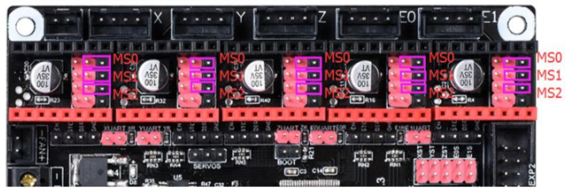
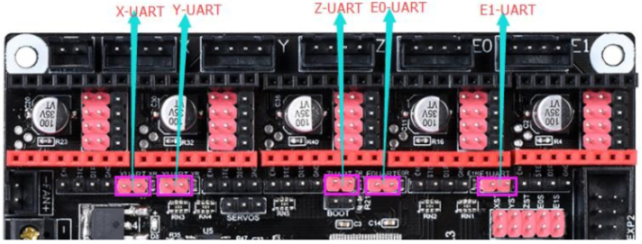

Zero To SKR (Ender 3)
=====================

This guide outlines how to set up a stock Ender 3 with a newly fitted SKR v1.3 from BigTreeTech.

Some sections may make references to the [original SKR manual](https://github.com/bigtreetech/BIGTREETECH-SKR-V1.3/blob/master/SKR%20V1.3-Instructions.pdf).

## Step 0 - Choose Mounting
The SKR does not fit as-is into the original housing, but you can print new boxes to mount them on.

 Some suggestions for front and rear mounting:

- Front: [https://www.thingiverse.com/thing:3425182](https://www.thingiverse.com/thing:3425182)
- Front (Upside-Down): [https://www.thingiverse.com/thing:3489836](https://www.thingiverse.com/thing:3489836)
- Rear: [https://www.thingiverse.com/thing:3688967](https://www.thingiverse.com/thing:3688967)

> Note! Depending on the mounting orientation, you may need to extend certain cables (such as for the bed or the Z axis endstop).

## Step 1 - Remove Melzi Board
The original board that came with the Ender 3 will have to be removed. 

There are three M3 screws on the top, and one M3 screw on the bottom of the control box that will have to be removed to loosen the original housing. Mark each cable to make rewiring easier.

> Note! Depending on the Ender 3 version, you'll have to remove their cable mangement (ties and tape) to loosen up the connectors going to each component).

## Step 2 - Set up SKR Board
The stock SKR has some jumpers that will need to be set before the new board can be wired up.

**Power Jumper** - A red jumper next to the CPU is set to USB power by default, *move* the jumper to `INT + 5v` to use the printer's internal PSU instead.

**Motor Driver Jumpers** - The SKR is set up to use TMC2130 drivers by default, *remove* all the jumpers between the driver sockets, as well as the 5 red jumpers next to the End Stop connectors.

**microSD Card** - An SD card is sometimes inserted on the board, *remove* it to prevent damage during install. You will need it later to upgrade the firmware.

## Step 3 - Install the Drivers
You will need 4 drivers to operate X, Y, Z, and Extruder. A popular choice are Trinamic's `TMC2208`, which are outlined here, but simpler drivers such as Allegro's `A4988` also work. 

**First** set the jumpers as outlined below for your particular model, then install each driver from left to right (on X, Y , Z, and E0) with the GND (Ground) and DIR (Direction) pins on each driver facing towards the EXP ports.

### Simple Drivers (A4988, etc)
You will only need to set the stepper subdivision mode using 3 jumpers for each driver as outlined in the following diagram. A4988s use all 3 jumpers, but different chips may require different setups.
> Note! Don't forget to adjust VREF pots as needed for each driver.

### TMC2208 Standalone (most drivers)
Most TMC2208 drivers come sold in standalone/legacy mode; they behave like simple drivers (but with advantages like quiet mode). This is the simplest way to install it without modifying the drivers.
> Note! Standalone mode also requires setting VREF pots for each driver.

### TMC2208 UART (some drivers, also solderdable)
Some drivers come sold with UART mode already enabled, but it is also possible to modify standalone drivers. Enabling UART will require soldering two pads on the bottom of each driver. Use the following jumper settings to enable UART functionality.

## Step 4 - Wire the SKR
Mount the SKR on the newly printed box, then wire each cable from the original setup into the new connectors. Each endstop cable will need to be modified with the left lug cut so it fits properly.

## Step 5 - Flash new firmware
The SKR should now power on with a red LED, but the stock display will remain blank and won't respond to any input. A new Marlin build can be created to enable the display as well as SD and other functionality.

Follow the [Marlin Installation Instructions for PlatformIO](http://marlinfw.org/docs/basics/install_platformio.html) to set up a new copy of Marlin and compile it for the SKR board.

## You're done!
You've made it to the bottom of the guide. Some further reading and resources that might be useful:

- [BigTreeTech's Github Source](https://github.com/bigtreetech/BIGTREETECH-SKR-V1.3)
- [Reddit's /r/3DPrinting](https://www.reddit.com/r/3Dprinting/)
- [Reddit's /r/Ender3](https://www.reddit.com/r/ender3/)
- [Discord's 3DPrinters Community](https://discord.gg/r66YbJS)
- [Discord's TH3D Community](https://discord.gg/SM4Tc6w)